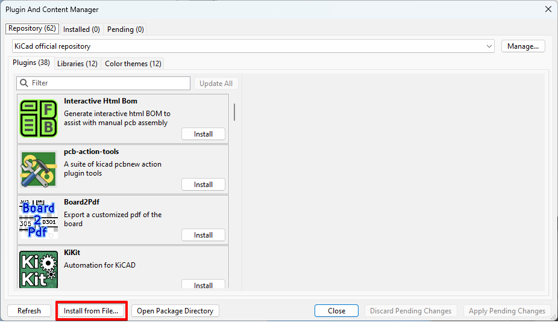
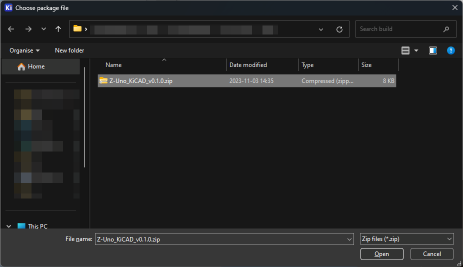
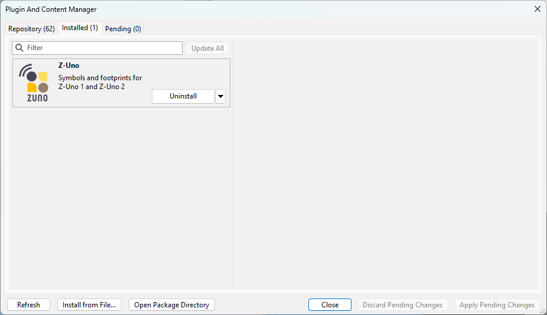

# zuno-kicad

## Installation

### From repository

### From file

Download the version you want from the [Releases](../../releases) page or the
[latest](../../releases/latest).

In KiCAD, open the `Plugin and Content Manager` window and click `Install from file...`.

[](images/install_from_file.png)

Select the zip file you downloaded and click `Open`.

[](images/select_zip.png)

The plugin should now show up under the `Installed` tab.

[](images/installed.png)

## Build from source

```
rake clean build
```

This create a zip file in the build directory. With that zip file you can follow
the [instructions above for installing from a file](#from-file).

## Repository
