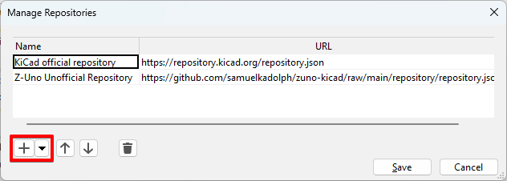

# zuno-kicad

## Installation

You can either install by adding a repository or directly with the zip file.
Using the repository makes it easier to get updates.

### From repository

In KiCAD, open the `Plugin and Content Manager` window and click `Manage...`.

[](images/manage_repositories.png)

Click `+` and use the following URL: `https://github.com/samuelkadolph/zuno-kicad/raw/main/repository/repository.json`.

[](images/add_repository.png)

Once the repository is added, you can click the drop down to select
`Z-Uno Unoffical Repository`. Then you select the `Libraries` tab. The `Z-Uno`
library show now show up. Click on `Install` and `Apply Pending Changes`.

[](images/repository_libraries.png)

### From file

Download the version you want from the [Releases](../../releases) page or the
[latest](../../releases/latest).

In KiCAD, open the `Plugin and Content Manager` window and click `Install from file...`.

[](images/install_from_file.png)

Select the zip file you downloaded and click `Open`.

[](images/select_zip.png)

The plugin should now show up under the `Installed` tab.

[](images/installed.png)

## Build from source

```
rake clean build
```

This create a zip file in the build directory. With that zip file you can follow
the [instructions above for installing from a file](#from-file).

## Repository

To add a release to the repository:

* Tag release and push to GitHub
* Add release on GitHub and upload zip
* Add release to packages.yaml
* Run `rake repository`
* Commit and push to GitHub
